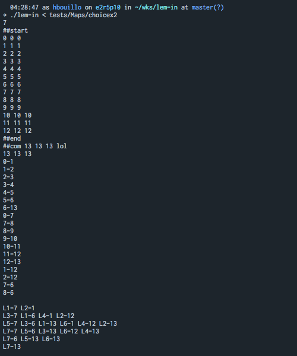
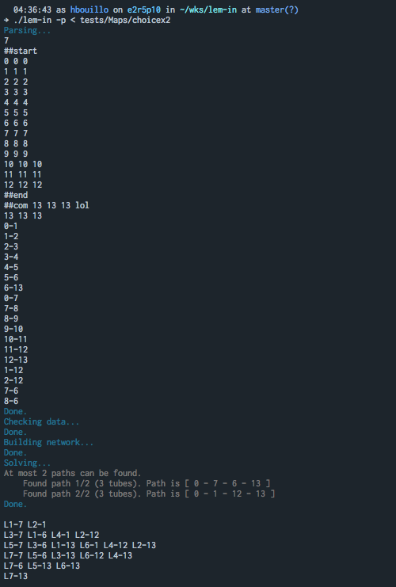
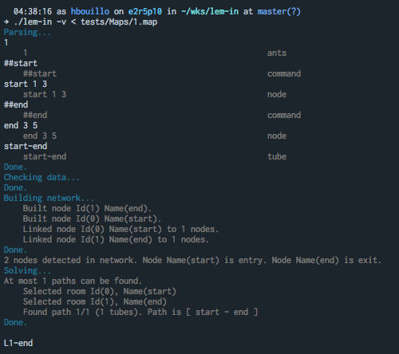

# Lem-in

Lem-in project for **42 Paris**. (hbouillo)

In brief, the project consists in running a certain amount of 'ants' in the fastest way possible in an 'anthill'. My implementation uses [Dijkstra's pathfinding algorithm](https://en.wikipedia.org/wiki/Dijkstra%27s_algorithm).

## Getting Started

This project has only been compiled and tested on **macOS Sierra (10.12.6)**. A few modifications might be necessary to compile it on any other system.

### Installing

After cloning the repository, simply run

```
make
```

to compile. An executable named ./lem-in should be created.

## How to use

lem-in takes commands on stdin. Tests and sample maps can be found in the [tests](tests/) folder.

```
Usage: lem-in [--verbose] [--print] [--max-paths n] [--max-path-length l] < test_map
	--print (-p): Starts lem-in in print mode. Shows only major steps.
	--verbose (-v): Starts lem-in in verbose mode. Shows every step lem-in does.
	--max-paths n (-n n): Lem-in won't search more than n paths. By default, no limit is set.
	--max-path-length l (-l l): Lem-in won't search paths longer than l nodes. By default, no limit is set.
```

### Map format (input)

A map is made of ***rooms*** and ***tubes***. ***Rooms*** are linked by ***tubes***. All distances are equal to 1.

The first line of a map must be the number of ants that will run through the map.

```
42
```

Any other line must be either a ***room descriptor***, a ***tube descriptor***, a ***command***, or a ***comment***.

#### Room

A ***room descriptor*** is a line with 3 fields separated by a space **' '**. The first field is the **room name**. Any name is legal, as long as it contains no space and doesn't start with **'L'**. The two other fields represents the coordinates of this room in a 2D environment. Those coordinates are completely ignored by the lem-in executable, but will be printed back on the output for more processing.

```
room_name x y
```

#### Room

A ***tube descriptor*** is a line with 2 fields separated by a dash **'-'**. Each field must be the name of a valid room.

```
room_1-room_2
```

#### Command

Any line that starts with two **'#'** is a  ***command***. lem-in only interprets two commands: **'##start'** and **'##end'**. A map without one of those commands will result in an error. They must be located before a valid ***room descriptor***. Any other command will be ignored and printed back on the output for more processing.

```
##start
room_1 0 0
```

#### Comment

Any line that starts with one **'#'** is a  ***command***. Any comment will be ignored and printed back on the output.

```
##start
room_1 0 0
```

### Result (output)

First, the map is fully printed back.

Then, the result will contain as many lines as there is cycles. Each cycles contains *n* movements, which are formated as shown below:

```
Lant_id-room_name
```

## Examples

### No verbose



### Essential verbose



### Full verbose



## Author

* **Hugo Bouillot (hbouillo)**

## License

This project is licensed under the MIT License - see the [LICENSE](LICENSE) file for details
